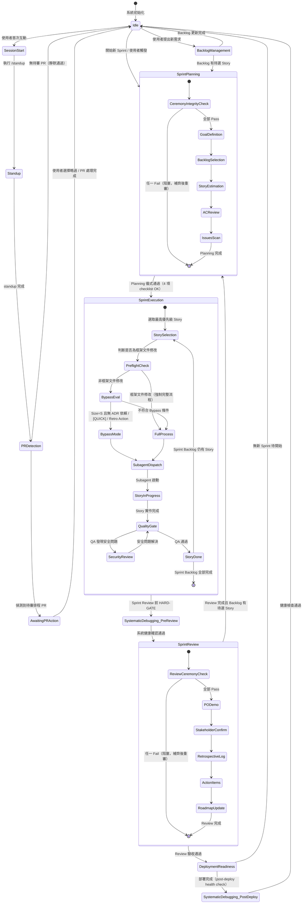
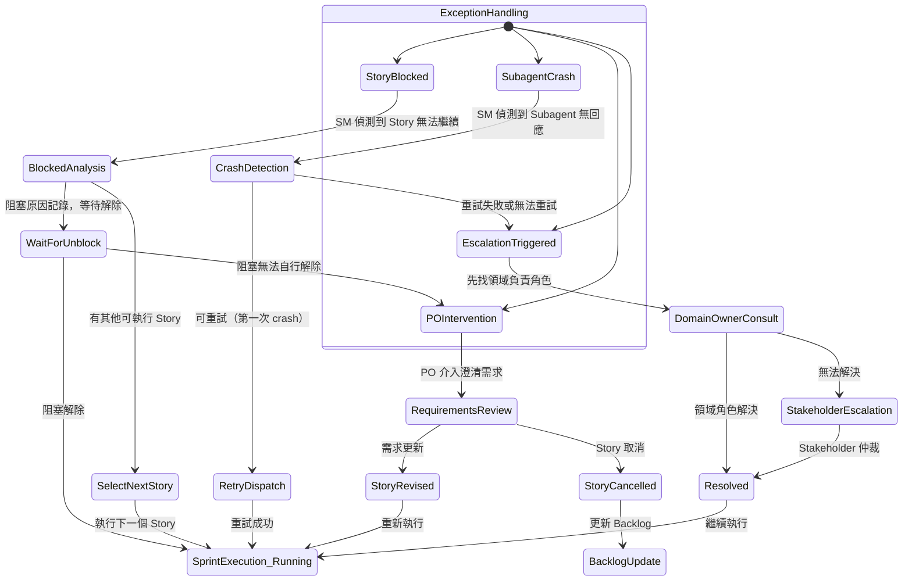
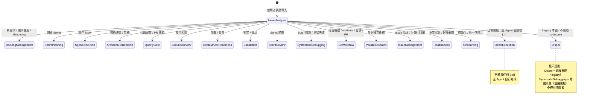
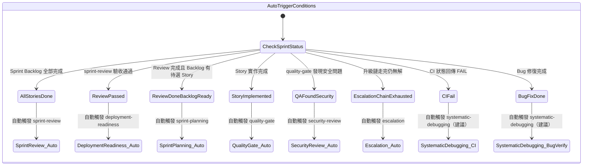
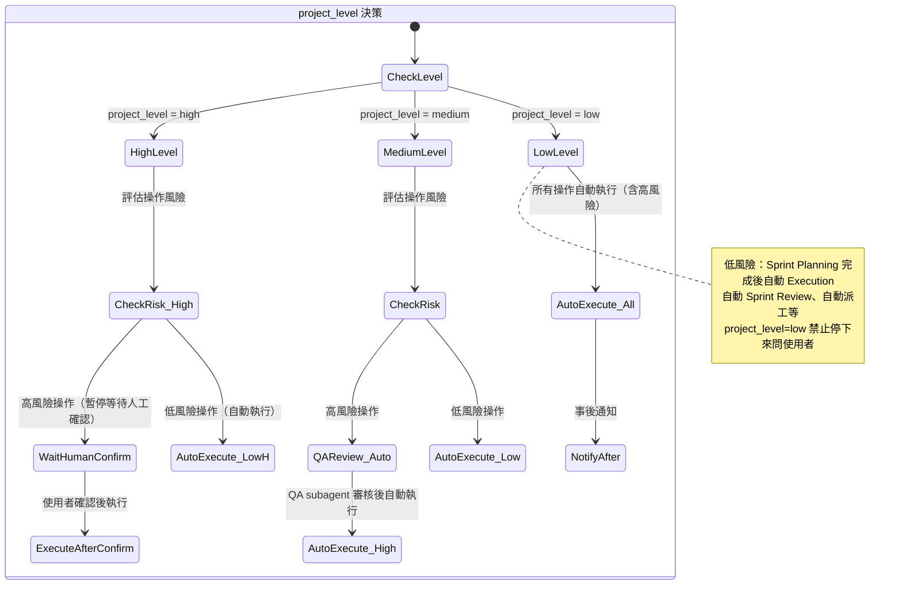

# Scrum Master 調度狀態圖

**文件類型**：SDD（輔助）
**最後更新**：2026-03-23
**維護者**：Scrum Master
**規格來源**：Issue #401、PB-2026-03-23-scrum-master-state-graph
**相關文件**：`skills/scrum-master/SKILL.md`

---

## 1. 說明

本文件以 Mermaid `stateDiagram-v2` 描述 Scrum Master 的完整調度狀態機，涵蓋：

- 標準 Sprint lifecycle：Planning → Execution → Review → Retrospective
- Exception path：Story blocked、Subagent crash、PO 介入、Escalation
- 關鍵轉換節點的決策樹說明

> **受眾**：Architect agent、Developer agent、Power User debug
> **原則**：本文件是行為文件化（documentation），不改變 SM 的實際調度行為

---

## 2. 完整 Sprint Lifecycle 狀態圖



---

## 3. Exception Path 狀態圖



---

## 4. 意圖路由狀態圖



---

## 5. 自動觸發狀態圖



---

## 6. project_level 行為矩陣



---

## 7. 關鍵轉換節點決策樹

### 7.1 Story 執行前：Bypass vs. 完整流程決策

```
Story 準備執行
├── 是框架文件修改（skills/、commands/、agents/ 下 .md）？
│   ├── YES → 強制完整流程（Bypass 禁止）
│   │         執行 Preflight Check（4 項 checklist）
│   │         全 Pass → 繼續 | 任一 Fail → 阻塞
│   └── NO ↓
├── 涉及外部 API 整合？
│   ├── YES → 強制完整流程（Bypass 禁止）
│   └── NO ↓
├── 涉及安全相關（認證 / 授權 / 加密 / 金鑰）？
│   ├── YES → 強制完整流程（Bypass 禁止）
│   └── NO ↓
├── Size = S 且無 ADR 依賴？
│   ├── YES → 可用 Bypass
│   └── NO ↓
├── 標注 [QUICK]？
│   ├── YES → 可用 Bypass
│   └── NO ↓
├── 來自 Retro Action Item？
│   ├── YES → 可用 Bypass
│   └── NO → 完整流程
│
└── [Bypass 可用時] Sprint 內 Bypass 使用數量 < 40% 上限？
    ├── YES → 套用 Bypass 模式（跳過：Architect 估點、QA AC 審查、雙階段 QA Review）
    └── NO → 已達上限，強制完整流程
```

### 7.2 Story Blocked 決策樹

```
偵測到 Story 阻塞
├── 阻塞原因是技術問題？
│   └── YES → 先找 Architect 協助解決
├── 阻塞原因是品質問題？
│   └── YES → 先找 QA Engineer
├── 阻塞原因是安全問題？
│   └── YES → 先找 Security Engineer
├── 阻塞原因是需求不明確？
│   └── YES → 找 Product Owner 澄清（PO 介入路徑）
├── 阻塞原因是部署 / 環境問題？
│   └── YES → 找 SRE Engineer
│
├── 有其他可執行 Story？
│   └── YES → 選取下一個 Story，繼續 Sprint Execution
│
├── 領域角色協助後仍無解？
│   └── YES → invoke shikigami:escalation
│
└── 升級鏈走完仍無解 → Stakeholder 最終仲裁
```

### 7.3 Subagent Crash Recovery 決策樹

```
Subagent 無回應 / 異常終止
├── 是第一次 crash？
│   ├── YES → 記錄 crash 原因，重新派遣（RetryDispatch）
│   └── NO ↓
├── 重試後再次 crash？
│   ├── Story 可拆分為更小任務？
│   │   └── YES → 拆分後重試
│   └── NO → 觸發 Escalation 路徑
│
└── 使用 SHIKIGAMI_SCHEDULED=1 環境下的 crash？
    └── 進入 worktree 隔離模式，建立 scheduled/* 分支
        等待下次互動 Session 自動偵測並建立 PR
```

### 7.4 Sprint Review 前 HARD-GATE 決策樹

```
Sprint Execution 完成，準備進入 Sprint Review
├── 強制執行 systematic-debugging（HARD-GATE）
│
├── systematic-debugging 結果：PASS？
│   ├── YES → 繼續進入 Sprint Review
│   └── NO → 停止進入 Review
│         系統健康問題需先修復
│         修復完成後重新執行 systematic-debugging
│
└── 進入 Sprint Review 儀式 Integrity Check（5 項 checklist）
    ├── 全部通過 → 儀式正常結束
    └── 任一未完成 → 阻塞，補齊後方可結束
```

---

## 8. 狀態定義索引

| 狀態 | 說明 | 觸發 Skill |
|------|------|-----------|
| `Idle` | 待機，等待使用者輸入或條件觸發 | — |
| `SessionStart` | Session 啟動序列開始 | `/standup` |
| `Standup` | 健康快篩 + Git 同步 + Sprint 進度 | `/standup` |
| `PRDetection` | 偵測待審排程 PR | — |
| `SprintPlanning` | Sprint 規劃儀式 | `sprint-planning` |
| `SprintExecution` | Story 執行中 | `sprint-execution` |
| `QualityGate` | 代碼審查與品質門禁 | `quality-gate` |
| `SecurityReview` | 安全性審查 | `security-review` |
| `SprintReview` | Sprint 回顧儀式 | `sprint-review` |
| `DeploymentReadiness` | 部署就緒檢查 | `deployment-readiness` |
| `SystematicDebugging_PreReview` | Review 前 HARD-GATE 健康檢查 | `systematic-debugging` |
| `SystematicDebugging_PostDeploy` | 部署後健康檢查 | `systematic-debugging` |
| `BacklogManagement` | Backlog 管理與 Grooming | `backlog-management` |
| `ArchitectureDecision` | 架構決策與 ADR | `architecture-decision` |
| `Escalation` | 升級鏈仲裁 | `escalation` |
| `GitWorkflow` | 分支 / worktree / PR 管理 | `git-workflow` |
| `ParallelDispatch` | 多任務並行調度 | `parallel-dispatch` |
| `IssueManagement` | GitHub Issue 管理 | `issue-management` |
| `HealthCheck` | 框架健康診斷 | `health-check` |
| `Onboarding` | 新用戶初始化 | `onboarding` |
| `Dispel` | Legacy codebase 考古 | `dispel` |
| `StoryBlocked` | Story 阻塞異常處理 | — |
| `SubagentCrash` | Subagent 異常恢復 | — |
| `POIntervention` | PO 介入需求澄清 | — |

---

## 9. 維護規範

1. **同步更新觸發條件**：每當 `skills/scrum-master/SKILL.md` 的 §5 或 §6 有變更，本文件必須同步更新
2. **新 Skill 接入**：新增 Skill 時，在第 4 節「意圖路由狀態圖」與第 8 節「狀態定義索引」中補充對應條目
3. **新 Exception Path**：發現新的異常情境時，在第 3 節補充對應 exception path
4. **DoD 條件**：SM Skill 變更的 DoD 必須包含「本文件已同步更新」
