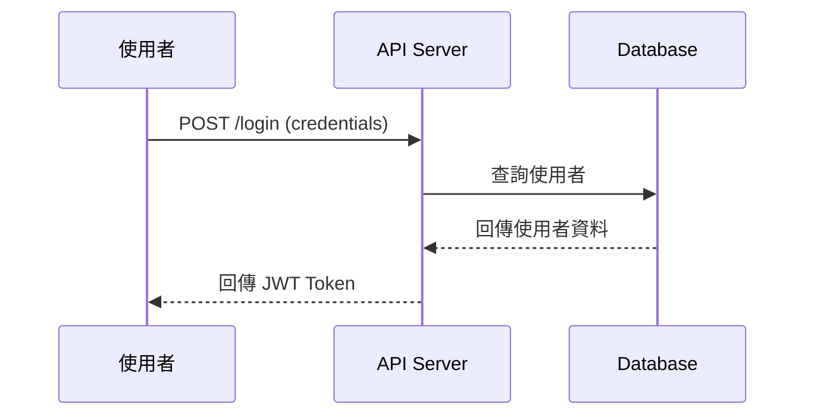
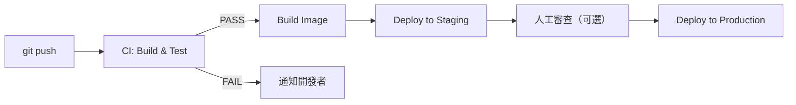

# 解咒 Dispel — Legacy 系統考古分析

## 1. 概述

Legacy 系統是前人施下的咒，你需要先解讀它才能動它。

解咒模式讓六個式神各自從角色視角分析**當前 repo**，產出「咒文解析」報告。報告是後續 `/sprint` 改動的基礎 — 先理解系統，再決定怎麼改。

**輸入**：當前 repo（使用者在目標 repo 中啟動 `/dispel`）
**輸出**：`docs/dispel/` 目錄，結構化多文件報告

---

## 2. 適用場景

- 接手一個不熟悉的 codebase
- 評估 Legacy 系統的改造可行性
- 進入新專案前的全面理解
- 技術債評估與重建規劃

**不適用**：活躍開發中的 bug 排查（→ 使用 `systematic-debugging`）

---

## 3. 輸出結構

```
docs/dispel/
├── summary.md          ← 執行摘要 + 整體評估（30 秒掃讀）
├── intent.md           ← PO：系統原始意圖、業務邏輯
├── architecture.md     ← Architect：模組結構、依賴、設計模式
├── codebase.md         ← Developer：代碼品質、技術債
├── quality.md          ← QA：測試覆蓋、品質缺口
├── security.md         ← Security：安全風險、漏洞
├── operations.md       ← SRE：部署、監控、維運
└── recommendations.md  ← 綜合重建建議 + 行動項目（銜接 /sprint）
```

---

## 4. 六角色分析框架

### 4.1 PO — 意圖解讀

分析系統的業務層面，回答「這個系統原本要解決什麼問題」：

- **業務目的**：系統的核心價值主張是什麼？服務哪些使用者？
- **功能邊界**：系統做什麼、不做什麼？與外部系統的整合點在哪？
- **需求考古**：從 README、文件、commit history、issue tracker 推斷原始需求演變
- **利害關係人**：誰在用這個系統？誰在維護？上次活躍是什麼時候？

**必要圖表（`docs/dispel/intent.md` 中必須包含）**：

1. **使用案例圖**（use case diagram）— 主要使用者角色與其對系統的互動

   ```mermaid
   graph LR
     User["使用者"]
     Admin["管理員"]
     Sys["系統"]
     User -->|"瀏覽內容"| Sys
     User -->|"提交請求"| Sys
     Admin -->|"管理設定"| Sys
   ```

2. **領域模型圖**（domain model diagram）— 核心業務概念與實體關係

   ```mermaid
   erDiagram
     USER ||--o{ ORDER : "places"
     ORDER ||--|{ LINE_ITEM : "contains"
     PRODUCT ||--o{ LINE_ITEM : "included in"
   ```

**產出**：`docs/dispel/intent.md`

### 4.2 Architect — 結構解讀

分析系統的架構層面，回答「這個系統是怎麼蓋的」：

- **模組結構**：目錄組織、模組邊界、分層架構（若有）
- **依賴關係**：內部模組依賴圖、外部依賴清單與版本狀態
- **設計模式**：使用了哪些設計模式？是否一致？
- **技術棧**：語言、框架、資料庫、基礎設施
- **架構債務**：設計決策中的已知妥協、過時的架構選擇

**必要圖表（`docs/dispel/architecture.md` 中必須包含）**：

1. **部署架構圖**（deployment diagram）— 服務、容器、外部依賴的部署拓撲

   ```mermaid
   graph TD
     Client["Client (Browser/App)"]
     API["API Server"]
     DB["Database"]
     Cache["Cache (Redis)"]
     Client --> API
     API --> DB
     API --> Cache
   ```

2. **模組依賴圖**（module dependency diagram）— 內部模組間的依賴方向

   ```mermaid
   graph LR
     A["Module A"] --> B["Module B"]
     A --> C["Module C"]
     B --> D["Module D"]
   ```

**產出**：`docs/dispel/architecture.md`

### 4.3 Developer — 實作解讀

分析系統的代碼層面，回答「這個代碼寫得怎麼樣」：

- **代碼品質**：命名慣例、一致性、可讀性、複雜度熱點
- **技術債清單**：hardcoded values、TODO/FIXME/HACK 標記、重複代碼
- **關鍵路徑**：核心業務邏輯的入口點與執行流程
- **修改熱點**：git log 分析 — 哪些文件改最多？哪些區域最脆弱？

**必要圖表（`docs/dispel/codebase.md` 中必須包含）**：

**關鍵業務流程圖（top 3）**：列出系統中最核心的三條業務流程，每條以 sequence 或 flowchart 呈現。

範例（以使用者登入流程為例）：



若系統複雜度不足以列出 3 條，列出所有可識別的主要業務流程即可，並說明原因。

**產出**：`docs/dispel/codebase.md`

### 4.4 QA — 驗證解讀

分析系統的品質層面，回答「這個系統的品質防線在哪」：

- **測試覆蓋**：有哪些測試？覆蓋率多少？測試是否還能跑？
- **測試品質**：測試是否有意義？是否有 flaky tests？
- **驗收標準**：能否從文件或測試推斷出原始驗收標準？
- **品質缺口**：哪些關鍵路徑完全沒有測試覆蓋？

**產出**：`docs/dispel/quality.md`

### 4.5 Security — 防禦解讀

分析系統的安全層面，回答「這個系統的安全風險在哪」：

- **認證授權**：如何處理身份驗證？權限模型是什麼？
- **輸入處理**：外部輸入是否經過驗證與消毒？SQL injection、XSS 風險？
- **敏感資料**：密鑰管理方式？是否有 hardcoded secrets？
- **依賴安全**：已知漏洞的依賴？過時的套件？

**產出**：`docs/dispel/security.md`

### 4.6 SRE — 維運解讀

分析系統的維運層面，回答「這個系統怎麼部署和維運」：

- **部署方式**：如何部署？CI/CD pipeline 是否存在且有效？
- **監控與日誌**：有哪些監控？日誌格式與層級？告警機制？
- **環境管理**：幾個環境？配置如何管理？環境差異？
- **災難恢復**：備份策略？回滾機制？RTO/RPO？

**必要圖表（`docs/dispel/operations.md` 中必須包含）**：

**CI/CD Pipeline 流程圖**：從 code push 到 production 部署的完整自動化流程。



若 CI/CD pipeline 不存在，標記「CI/CD 缺失」並說明現有部署方式。

**產出**：`docs/dispel/operations.md`

---

## 5. 執行流程

```
使用者啟動 /dispel
  |
  v
Scrum Master：觸發 shikigami:dispel
  |
  v
建立 docs/dispel/ 目錄
  |
  v
派遣 6 個 subagent 並行分析（invoke shikigami:parallel-dispatch）
  ├── PO subagent → intent.md
  ├── Architect subagent → architecture.md
  ├── Developer subagent → codebase.md
  ├── QA subagent → quality.md
  ├── Security subagent → security.md
  └── SRE subagent → operations.md
  |
  v
彙整六份報告，產出：
  ├── summary.md（執行摘要 + 整體評估）
  └── recommendations.md（重建建議 + 行動項目）
  |
  v
提示使用者：「解咒完成。可用 /sprint 開始改動。」
```

### 步驟詳解

1. **建立輸出目錄**：建立 `docs/dispel/`，若已存在則詢問是否覆蓋。
2. **並行分析**：六個 subagent 各自從角色視角分析當前 repo，產出獨立報告。每個 subagent 遵循對應角色的分析框架（第 4 節）。
3. **彙整摘要**：讀取六份報告，產出 `summary.md`（一頁摘要，30 秒可讀完）與 `recommendations.md`（具體行動項目，可直接轉為 Backlog Stories）。
4. **銜接 Sprint**：`recommendations.md` 的行動項目格式與 GitHub Issues 的 User Story 格式對齊，便於透過 `/issue-management` Backlog Bridge 直接匯入至 GitHub Issues。

---

## 6. summary.md 格式

```markdown
# 咒文解析：<repo-name>

> 解咒日期：YYYY-MM-DD

## 整體評估

| 維度 | 評級 | 摘要 |
|------|------|------|
| 業務意圖 | 清晰/模糊/不明 | 一句話 |
| 架構健康 | 良好/尚可/脆弱 | 一句話 |
| 代碼品質 | 良好/尚可/需重構 | 一句話 |
| 測試覆蓋 | 充足/不足/缺失 | 一句話 |
| 安全狀態 | 安全/有風險/危險 | 一句話 |
| 維運成熟度 | 成熟/基本/原始 | 一句話 |

## 關鍵發現

1. [最重要的發現]
2. [次要發現]
3. [第三個發現]

## 建議優先級

見 [recommendations.md](recommendations.md)
```

---

## 7. recommendations.md 格式

```markdown
# 重建建議：<repo-name>

## 立即行動（Quick Wins）

| # | 建議 | 來源 | 影響 | 工時估算 |
|---|------|------|------|----------|
| 1 | ... | Security | 高 | S |

## 短期改善（1-2 Sprint）

| # | 建議 | 來源 | 影響 | 工時估算 |
|---|------|------|------|----------|
| 1 | ... | Architect | 中 | M |

## 長期規劃（3+ Sprint）

| # | 建議 | 來源 | 影響 | 工時估算 |
|---|------|------|------|----------|
| 1 | ... | Developer | 高 | L |
```

---

## 8. 與其他 Skill 的關係

| 銜接 | 說明 |
|------|------|
| `/dispel` → `/sprint` | 解咒完成後，recommendations.md 的行動項目透過 `/issue-management` Backlog Bridge 匯入至 GitHub Issues，啟動 Sprint |
| dispel vs systematic-debugging | dispel = Legacy/不活躍 codebase 全面考古；systematic-debugging = 活躍開發中的特定 bug/測試失敗 |
| dispel → `/issue-management` | recommendations.md 的行動項目可直接由 PO 評分後，透過 `/issue-management` Backlog Bridge 排入 GitHub Issues Backlog |
